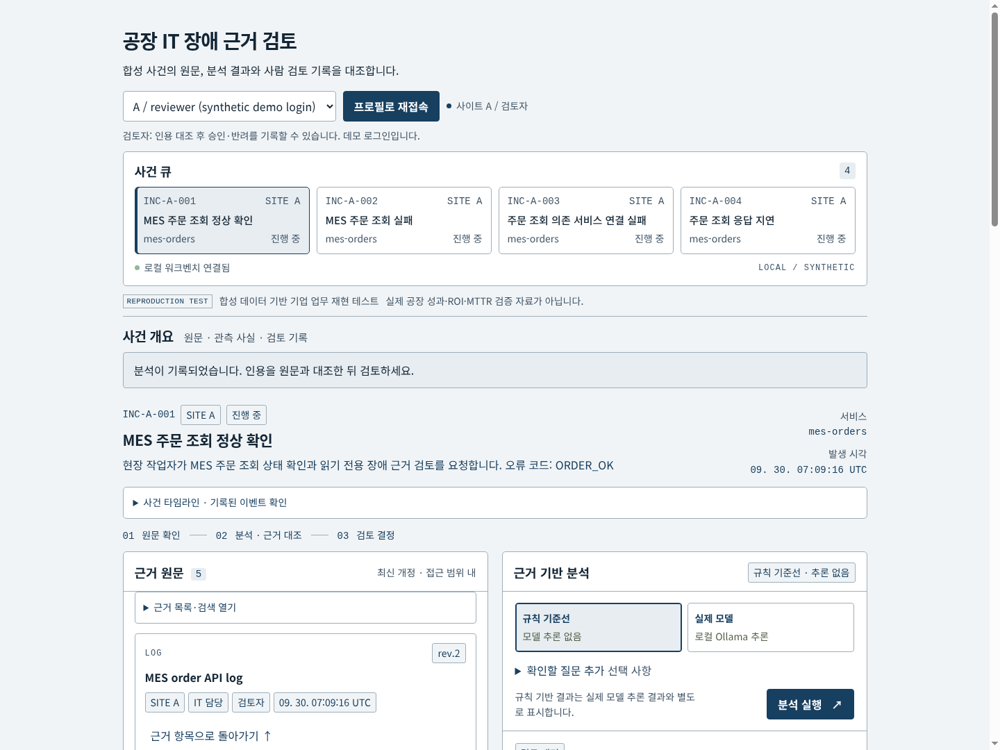
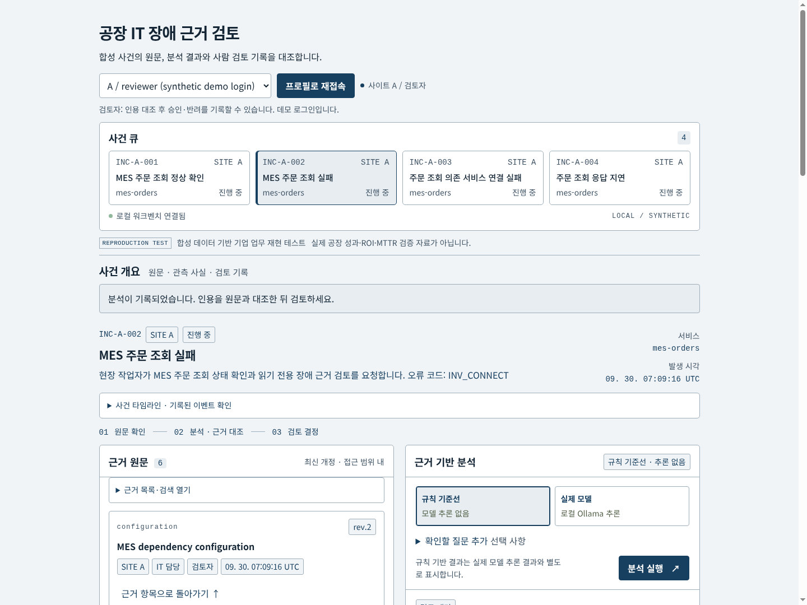
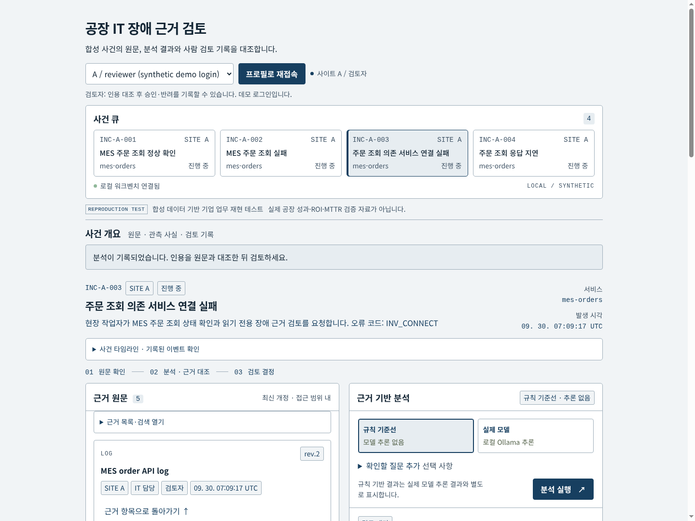
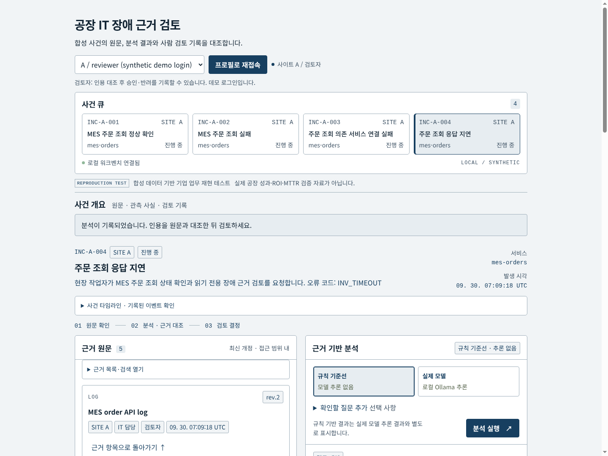
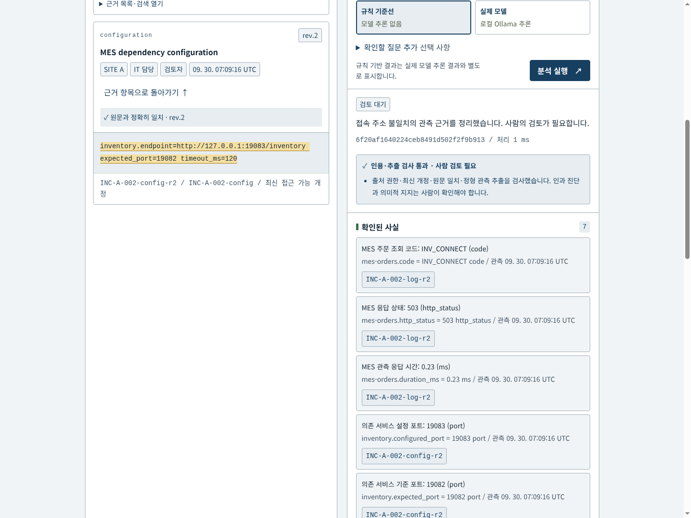
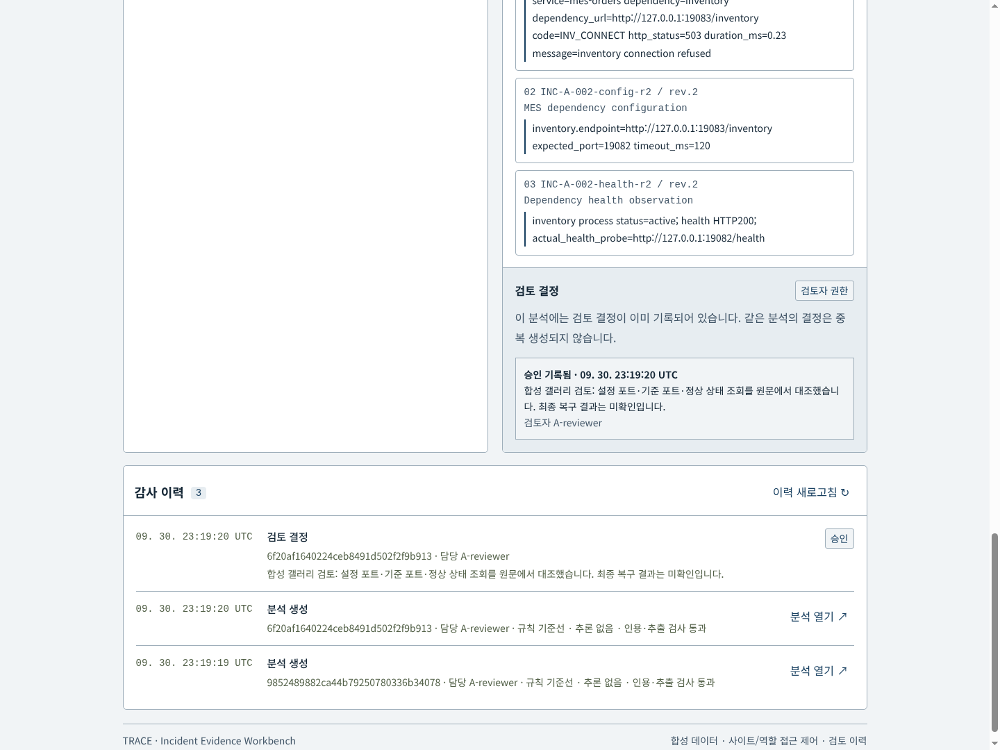
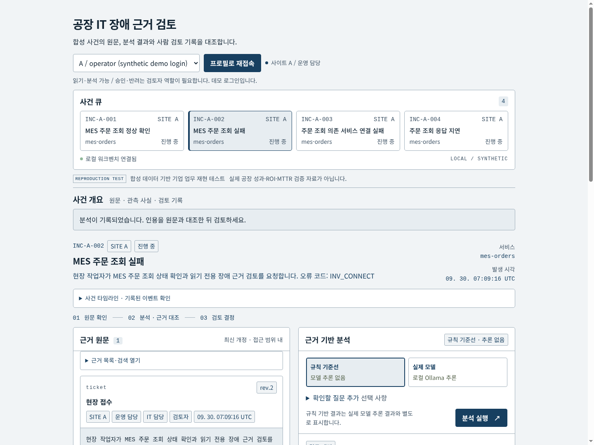
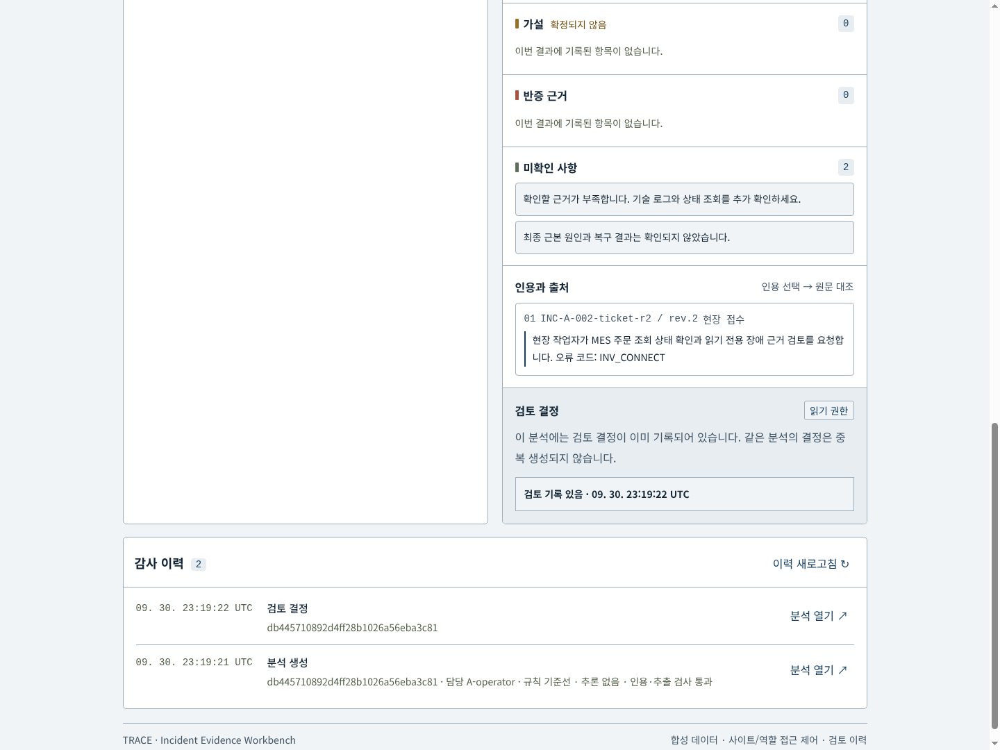
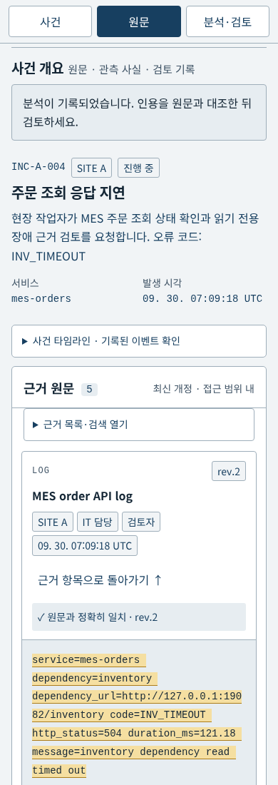
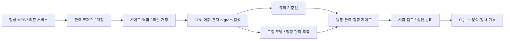

# TRACE — Factory IT Incident Evidence Workbench


[Editable SVG](docs/architecture.svg) · [Architecture provenance](docs/architecture-provenance.md)

Browser and synthetic JSON feed Python CPU retrieval and source validation. Optional serial Ollama/Qwen extraction returns to the validation gate; human review and audit persist in SQLite.

**한국어 장애 접수에서 원문 근거, 관측 사실, 잠정 가설, 사람의 검토 기록까지 이어지는 로컬 작업 공간입니다.**

합성 데이터로 기업 업무 흐름을 재현하는 엔지니어링 테스트입니다. 실제 공장·MES·OT 시스템에 연결하지 않으며, 실제 공장 ROI나 MTTR 개선 효과를 검증한 프로젝트가 아닙니다.

## 현재 화면: 사건부터 검토 기록까지

P09 v2 개발 화면의 밝은 회색 바탕(`#f1f4f6`), 남색 본문(`#142635`), 선택 버튼(`#173f60`), 흰 근거·결과 카드와 회색 원문 블록을 적용했습니다. 화면 위에는 한 줄 한국어 제목과 역할·사건 선택을 두고, 아래 두 열에 원문과 결과를 나란히 표시합니다. 390px에서는 작업 탭으로 이동합니다. 이 화면은 합성 사건을 실제 Chrome에서 캡처했으며 **9장 모두 규칙 기준선, 모델 요청 0회**입니다.

| 순서 | 실제 화면 | 확인할 기능 |
| --- | --- | --- |
| 1 |  | 사건 선택 · 정상 접수 근거 |
| 2 |  | 설정 주소와 기준 포트 대조 |
| 3 |  | 연결 오류와 상태 조회 분리 |
| 4 |  | 지연 관측과 반증 |
| 5 |  | 정확한 부분 문자열·개정 대조 |
| 6 |  | 사람 검토 기록 · 감사 이력 |
| 7 |  | 역할별 근거·승인 제한 |
| 8 |  | 비공개 결정 중립 표시 |
| 9 |  | 모바일 원문 · 가로 넘침 없음 |

[현재 캡처 조건과 파일별 해시](docs/demo/refit-gallery/README.md). 본문·조작부는 16px, 밀집한 원문·메타데이터는 14px 이상을 목표로 합니다. 만료 세션과 실제 권한 거절을 구분하고, 키보드 사건 선택·포커스 복귀·reduced-motion 이동을 유지합니다. 이 검사는 완전한 접근성 인증이 아닙니다.

이전 레이아웃의 [UI 변경 전후](docs/demo/ui-refresh/README.md), [초기 10장 갤러리](docs/demo/gallery/README.md), [실제 동작 영상](docs/demo/demo.mp4)은 **역사적 자료**로 남겨 둡니다. 초기 영상과 10번째 갤러리 사진에는 당시 실제 모델 추출이 포함되지만 현재 디자인을 보여주지 않습니다. 실제 모델은 정형 관측 추출에 사용하며 원인 가설은 잠정 규칙 결과입니다.

## 누구를 위한 프로젝트인가

공장 IT 지원 담당자가 장애 접수 내용, 영어 서비스 로그, 의존 서비스 설정과 상태 조회를 한 사건 안에서 검토하는 상황을 재현합니다. 운영 담당자는 허용된 접수 자료를 읽고, IT 담당자는 기술 근거를 분석하며, 검토자는 승인 또는 반려와 그 이유를 기록합니다.

중심 문제는 원인 문장을 생성하는 데 그치지 않습니다. 같은 사건이라도 사이트·역할에 따라 볼 수 있는 자료가 다르고, 문서 개정이 바뀌면 이전 인용이 현재 근거를 대표하지 않을 수 있습니다. 확인된 관측과 잠정 가설을 구분하고, 결과가 어떤 원문·개정·관측 시각에 연결되는지 확인할 수 있어야 합니다.

이 프로젝트는 다음 흐름을 구현합니다.

1. 데모 프로필로 사이트와 역할을 선택합니다.
2. 접근 가능한 사건·타임라인·최신 개정 근거를 읽습니다.
3. CPU 검색으로 사건 관련 근거를 선택합니다.
4. 규칙 기준선 또는 명시적으로 요청한 로컬 모델 추출을 실행합니다.
5. 사실·가설·반증·미확인 사항을 구분하고 인용을 원문과 대조합니다.
6. 검토자가 통과한 분석을 승인하거나, 의견과 함께 반려합니다.
7. 분석과 결정의 감사 이력을 저장하고 다시 확인합니다.

승인은 검토 기록입니다. 설정 변경, 서비스 재시작, 자동 복구 또는 외부 메시지 전송을 실행하지 않습니다.

## 구현 상태

| 영역 | 현재 구현 |
| --- | --- |
| 사건과 원문 | A/B 합성 사이트, 사건 목록, 타임라인, 원문, 개정·사이트·역할 표시 |
| 접근 제어 | 서버 발급 opaque bearer 세션, 모든 주요 읽기 API에서 사이트·역할 재검사 |
| 최신 개정 | 논리 문서의 최신 개정을 먼저 선택한 뒤 ACL 검사; 접근 불가한 최신 문서를 과거 개정으로 대체하지 않음 |
| 검색 | 기본 token overlap 어휘 검색; 문자3gram+코드 boost는 CPU 비교용 내부 옵션 |
| 규칙 기준선 | 관측 사실, 잠정 원인 범주, 반증과 미확인 사항; 모델 추론을 사용하지 않음 |
| 실제 모델 | 기존 로컬 Ollama 모델로 제한된 정형 관측 JSON과 원문 인용 추출 |
| 검증 게이트 | 출처·개정·정확한 인용·관측 필드·누락 검증; 실패/제한 결과 승인 차단 |
| 사람 검토 | reviewer 역할만 승인·반려; 분석당 유일한 결정과 멱등 처리 |
| 감사 이력 | 분석 생성·검토 결정 저장, 역할별 필드 제한, 저장된 분석 다시 열기 |
| 화면 | 한국어 근거 워크벤치, 반응형 레이아웃, 키보드 조작, 외부 CDN 없음 |
| n8n | [설계 문서](docs/n8n-adapter-design.md)만 존재; 설치·워크플로 실행·커넥터 연결 없음 |

**아직 구현·검증하지 않은 영역:** 의미 임베딩 검색, 벡터 데이터베이스, CAG/cache-hit 비교, 독립적인 모델 근본 원인 진단, 실제 공장 데이터 평가, 자동 조치, 기업 SSO, n8n 실행 연동.

## 구조와 책임



- `simulator/`: 별도 loopback HTTP 프로세스로 주문 읽기와 의존 서비스 응답을 관측합니다. 정상, 잘못된 접속 주소, 의존 서비스 비활성, 상태 조회는 정상이나 요청이 지연되는 상황을 재현합니다.
- `data/corpus.json`: 런타임이 읽는 사건·문서 코퍼스입니다. 현재 스냅샷은 사건 8개와 개정 이력을 포함한 문서 70개입니다. 평가 정답은 포함하지 않습니다.
- `workbench/core.py`: 세션, ACL, 최신 개정, 검색, 분석 검증, 검토와 감사 저장을 담당합니다.
- `workbench/rules.py`: IT 도메인의 관측 파싱과 잠정 가설 규칙을 담당합니다.
- `workbench/llm.py`: 고정된 loopback Ollama 대상에 제한된 추출 요청만 전달합니다.
- `workbench/server.py`: 표준 라이브러리 HTTP 서버와 정확한 정적 파일 허용 목록을 제공합니다.
- `static/`: 원문과 구조화 분석을 대조하는 한국어 화면입니다.
- `tests/`: 합성 fixture와 모델 mock을 이용한 엔지니어링 테스트입니다.
- `scripts/`: 실제 모델 준비성·고정 회귀 평가와 브라우저 확인 도구입니다.
- `artifacts/`: 로컬 실행 로그·평가·SQLite·모델 요청/응답 자료입니다. 기본적으로 Git 추적에서 제외됩니다.

API와 객체 필드는 [계약 문서](docs/contract.md)를 참조하세요. 다음 SOP 프로젝트와 공유할 후보·공유하지 않을 상태는 [공유 코어 경계](docs/shared-core-boundary.md)에 정리했습니다. 현재 배포된 공통 패키지는 없습니다.

## 실제 모델의 역할과 제한

현재 모델 경로는 **정형 관측 추출**입니다. 모델에 독립적인 최종 장애 진단을 맡기지 않습니다.

모델은 선택된 원문에서 다음 필드를 추출합니다.

```text
code, http_status, duration_ms,
configured_port, expected_port,
dependency_status, health_http_status
```

없으면 `null`이어야 합니다. 추출된 모든 값은 CPU가 원문에서 파싱한 관측값과 비교합니다. 출처는 선택된 문서 중 하나여야 하고, 인용은 해당 원문의 정확한 부분 문자열이어야 합니다. 검증 후 표시되는 관측 사실은 정형 데이터에서 생성하고, 원인 가설·반증·요약은 명시적인 잠정 규칙 결과로 구성합니다. JSON 문법이나 HTTP 200만으로 의미적 정확성을 인정하지 않습니다.

실행 환경의 허용 모델 alias는 `qwen3:4b`이며, 관측한 설치 모델은 Qwen3-4B-Thinking-2507 계열입니다. 같은 alias라도 다른 환경에서는 모델 내용이 다를 수 있으므로 재현 시 설치된 모델과 버전을 확인해야 합니다. 공식 모델 카드가 설명하는 thinking-only 특성과 이 프로젝트의 `think:false` 요청은 구분합니다. 요청 옵션으로 thinking이 완전히 꺼졌음을 검증한 상태가 아닙니다. [Qwen 공식 모델 카드](https://huggingface.co/Qwen/Qwen3-4B-Thinking-2507)

기본 token 검색 전환 후 동일 고정 4건을 재검증해 실제 추출4/4·규칙4/4, 요청2.626–4.337초를 기록했습니다. 이 반복 측정도 독립 holdout이 아닙니다.

현재 추출 요청은 4,096 문맥, 최대 256 출력 토큰, 선택 근거 최대 6개, 원문 문자 예산을 사용합니다. 원문을 조용히 잘라 맞추지 않습니다.

공유 추론 lock 기본은 ~/.cache/ax-lab/runtime/inference.lock이며 clone 깊이와 관계없습니다. 다른 위치는 두 프로젝트에 동일한 절대경로 AX_LAB_INFERENCE_LOCK을 명시합니다. 운영자에게 비공개된 승인/반려는 “검토 기록 있음”으로 중립 표시하며 실제 브라우저에서 두 결정 모두 재확인했습니다. 불완전 JSON, 값/필드 불일치, 잘못된 인용, 초과 예산, 모델 연결 실패 또는 시간 초과는 제한 결과와 실패 게이트로 남습니다.

추론은 프로세스 내부 단일 실행과 공통 파일 lease로 직렬화합니다. 시간 초과 시 영속 blocked marker가 남아 다른 프로젝트와 재시작한 프로세스도 새 모델 요청을 차단합니다. 복구하려면 기존 서버에서 **해당 시간 초과 요청의 종료를 확인하고, 그 marker만 명시적으로 해제한 뒤 해당 클라이언트를 재시작**해야 합니다. 재시작만으로는 해제되지 않으며 `/api/ps`의 모델 목록만으로 요청 종료를 증명할 수 없습니다. 정확한 절차와 marker 저장 실패 시 한계는 [공통 추론 안전 정책](docs/shared-inference-policy.md)을 확인하세요. 자동 재시도나 자동 marker 해제는 없습니다. 모델에는 도구, 승인 쓰기 API, shell, 임의 파일 접근 또는 평가 정답을 제공하지 않습니다.

## 로컬 실행

### 요구 환경

기본 사건 조회·규칙 기준선·테스트는 **Python 3.10+ 표준 라이브러리**로 실행됩니다. 필수 pip 의존성은 없습니다. 로컬 모델 경로의 파일 lease는 Linux `fcntl`을 사용합니다. 화면에는 빌드 단계·Node 패키지·CDN이 필요하지 않습니다.

실제 모델 모드는 로컬에서 실행 중인 Ollama와 이미 준비된 허용 모델이 있어야 합니다. 저장소는 모델 가중치를 포함하지 않고, 실행 중 모델을 자동 다운로드하지 않습니다. Ollama 버전과 모델 양자화·alias는 결과에 영향을 줄 수 있습니다. 관측 평가 환경은 Ollama 0.17.7입니다.

### 테스트와 서버

저장소 루트에서 실행합니다.

```sh
python3 -m venv --without-pip .venv
.venv/bin/python -m unittest discover -s tests -v
.venv/bin/python -m workbench.server
```

브라우저에서 [http://127.0.0.1:19080](http://127.0.0.1:19080)을 엽니다. 앱은 loopback에만 바인딩합니다. 종료는 실행한 터미널에서 `Ctrl+C`로 합니다.

기본 corpus와 DB 경로는 저장소 내부입니다. 독립 DB로 실행하려면 다음처럼 상대 경로를 사용합니다.

```sh
.venv/bin/python -m workbench.server --db data/demo.sqlite3 --port 19080
```

`A-it`로 사건을 분석하고 인용을 확인할 수 있습니다. `A-reviewer`로 다시 접속하면 감사 이력에서 해당 분석을 열어 검토할 수 있습니다. 운영 담당자는 기술 근거 및 reviewer 전용 기록에 접근할 수 없습니다. 프로필 선택은 **합성 데모 로그인**이며 기업 인증이나 SSO를 대체하지 않습니다.

### 합성 관측 다시 수집

이미 존재하는 corpus는 기본 생성 명령으로 덮어쓰지 않습니다. 새 관측을 개정으로 추가하려면 명시적으로 실행합니다.

```sh
.venv/bin/python -m simulator.generate --append-revision
```

이 명령은 합성 주문 서버와 의존 서비스 서버에 loopback 포트 19081·19082를 사용합니다. 잘못된 주소 시나리오는 사용하지 않는 19083을 대상으로 합니다. 포트가 비어 있어야 하며, 다른 프로세스를 종료하지 마세요. 새 개정은 이전 원문을 보존하지만 corpus 해시와 평가 입력이 달라집니다.

### 실제 모델 평가

다음 명령은 실제 추론을 요청합니다. 기본 단위 테스트와 별도로 실행하며, 기존 GPU 작업과 겹치지 않는 환경에서만 사용합니다.

```sh
.venv/bin/python -m scripts.model_readiness
.venv/bin/python -m scripts.heldout_eval
```

두 번째 스크립트 이름은 `heldout_eval`이지만 현재 기록된 B 사례는 개발 중 이미 관측했습니다. 결과는 **고정 합성 회귀 평가**로 해석해야 합니다. evaluator만 별도 `evaluations/fixed_expected.json` (재수집 시 `artifacts/heldout_expected.json`)의 정답을 읽고, 런타임 검색·모델 경로는 이를 읽지 않습니다. 평가 전에 재수집했다면 초기 기록과 동일한 입력이라는 가정을 하지 마세요.

## 확인한 결과와 해석

2026-09-30의 로컬 기록 기준입니다. 자세한 범위는 [평가 manifest](docs/evalmanifest.md)와 [실패 기록](docs/failurelog.md)에 있습니다.

| 확인 | 기록 | 의미와 한계 |
| --- | --- | --- |
| 엔지니어링 테스트 | **50개 통과** (기존 41 + portable lock 회귀 7 + 지속 timeout barrier 회귀 2) | ACL, 최신 개정, 정형 관측, 정확한 인용, 실패 게이트, 멱등·동시 검토 등을 fixture/mock으로 확인; 실제 모델 성능 측정과 구분 |
| 고정 B 사례 규칙 기준선 | **4/4 통과** | 정상·접속 주소 불일치·의존 서비스 비활성·지연 시나리오의 명시적 규칙 확인 |
| 고정 B 사례 실제 모델 추출 | **4/4 통과** | 실제 Ollama 정형 관측 추출과 게이트 확인; 독립적인 모델 원인 진단 점수가 아님 |
| 실제 모델 요청 시간 | 약 **2.58–4.37초** | 네 요청의 관측 범위; SLA, 실공장 응답 시간 또는 모델 간 우위 주장에 사용하지 않음 |
| 관측 GPU 메모리 최고값 | **3,451 MiB** (첫 측정), 기본 token 전환 후 **3,527 MiB** | 평가 중 수집한 GPU 상태 스냅샷; 프로젝트 단독 메모리 요구량으로 일반화하지 않음 |
| 브라우저 | 데스크톱·모바일 확인 | 원문·분석·검토·감사 이력 흐름과 표시 확인; 위 이미지가 실제 화면 자료 |

고정 회귀의 입력 corpus SHA-256은 `62f7f56e1d7e2e08835dbf1402a21d31d24fb23350dfb24b53e2f5b5faf16970`입니다. 개정 수집 후 해시가 달라지면 이 결과와 동일 실험으로 취급하지 않습니다.

네 사례는 개발 과정에서 이미 관측한 작은 합성 사례입니다. 미관측 데이터 일반화, 실제 공장 효과, 정밀한 언어 추론, 완전한 의미적 함의 또는 독립 진단 성능을 증명하지 않습니다. 정상 문서의 인용이 맞더라도 가설 자체가 참이라는 결론은 나오지 않습니다. 마지막 판단은 사람이 원문과 미확인 사항을 확인해야 합니다.

## CPU 검색 비교

추론 없이 고정 17개 질의에서 동일 권한·최신 개정·문서·질의·상위 문서 수와 4096 UTF-8 content-byte 예산으로 token overlap과 현재 문자3gram+오류코드 검색을 비교했습니다. 상위 3개에서 기술·한국어 질의의 필수 span recall은 hybrid **0.40**, token **0.80**이었습니다. exact-ID 목표는 **1/3 대 2/3**이며 현재 문서 ID 자체를 검색 필드에 넣지 않습니다. 코드·반증·최신 개정 질의는 동률입니다. 기본 상위 6개는 양쪽 모두 전체 목표를 포함했지만 후보군이 대부분 전부 들어가고 바이트 예산도 구속적이지 않았습니다(최대933/4096bytes). 검색 개선 또는 의미 검색의 이점으로 주장하지 않습니다.

권한·개정 negative 검사 **16/16**은 모델 품질과 분리합니다. 측정 자료와 재현 명령은 [검색 평가 기록](docs/evaluations/retrieval-report.md), `python3 -m scripts.retrieval_eval`에 있습니다.


기술 질의4개와 한국어 질의4개에서 top3 완전 span coverage는 두 방법 모두 각각0/4입니다. 평균0.80은 질의80%를 완전히 답했다는 뜻이 아니라 필수span5개 중 평균4개를 회수했다는 뜻입니다. hybrid0.40은 평균2/5span입니다. korean-004는 config의 L+P+G=.301315가 runbook .188192보다 높지만, 코드boost+3으로runbook3.188192가 되어 config가3위에서4위로 밀립니다. technical-002는 trigram 차이도 작용하므로 코드boost만의 인과 사례로 단정하지 않습니다.595/4096byte packet이므로 packing 부족이 아닙니다. 동일17개 질의에 가중치를 맞춰 개선을 주장하지 않습니다.

## 제조 전산실 업무와 구현 경계

대상은 제조공장 전산실 MES 장애 담당자입니다. 현재 합성 주문조회→재고 의존 서비스로 공통 근거 검토 흐름을 재현합니다. 생산실적 전송 실패·MES–ERP 연계 지연·라인 단말 장애까지 구현했다고 주장하지 않습니다.

| 참고 업무 | 현재 자체 재현 | 검증 자료 | 아직 없는 부분 |
| --- | --- | --- | --- |
| [Bosch 공개 Shopfloor Agent 사례](https://www.bosch.com/stories/agentic-ai-manufacturing-production/)의 장애 접수·서비스 지원 | 사건 원문·관측·잠정 가설·사람 검토 | 50 engineering tests, 실제추출4개 고정회귀, 실제화면 | 공장·라인·설비ID 누락질문, 과거 유사장애검색 |
| 설비·버전 적합 자료와 인수인계라는 후속 업무 목표 | 사이트·역할·문서 최신 개정 검사 | ACL/revision negatives16/16, 실제운영자중립표시 회귀 | MES/설비버전 적용조건, 교대간 미해결·인수인계 |

기업 공개 업무를 참고한 자체 구현이며 기업 내부 아키텍처·데이터를 재현했다고 주장하지 않습니다. 후속 fixture에는 공장·라인·설비·MES 버전·교대 식별자와 모의 프로세스 관계를 넣고 필수필드 누락·교대간 미해결·버전 적용조건을 따로 검증해야 합니다. 이 도메인 확장은 계획 단계입니다. BMW Factory Genius 공식 발표 링크와 대응은 추가 검증 후 보강합니다.

## 연구·설계 참고

참고 사례는 문제 선택과 설계 방향을 위한 근거입니다. 이 프로젝트의 성능 결과로 가져오지 않습니다.

- [Bosch Shopfloor Agent](https://www.bosch.com/stories/agentic-ai-manufacturing-production/): 생산 현장의 장애 대응과 기록 부담을 다루는 실제 산업 사례. 이 프로젝트는 해당 제품의 복제·연동·실공장 성능 검증이 아닙니다.
- [Qwen3-4B-Thinking-2507 공식 모델 카드](https://huggingface.co/Qwen/Qwen3-4B-Thinking-2507): 모델 특성과 thinking-only 제한, 라이선스 확인.
- [Ollama Structured Outputs](https://docs.ollama.com/capabilities/structured-outputs): JSON schema 제약과 응답 검증 방식. 형식 제약을 정답 보장으로 해석하지 않습니다.
- [RCAEval 저장소](https://github.com/phamquiluan/RCAEval), [논문](https://arxiv.org/abs/2412.17015): 향후 별도 마이크로서비스 외부 평가 후보. 데이터는 아직 내려받지 않았으며 이 저장소의 합성 MES 결과에 합산하지 않습니다.
- 초기 조사에서 살펴본 [MakinaRocks 직무 링크](https://makinarocks.career.greetinghr.com/ko/o/238056)와 [DeepAuto 직무 링크](https://deepauto-ai.career.greetinghr.com/ko/o/209187)는 산업 업무·역량 탐색 참고입니다. 현재 공고 유효성이나 채용 상태를 주장하지 않습니다.

n8n 갤러리 패턴의 출처와 실행하지 않은 연동 범위는 [n8n adapter 설계](docs/n8n-adapter-design.md)를 참조하세요.

## 남은 한계와 다음 단계

1. 기존에 관측하지 않은 소규모 사례를 따로 분리하고, 정답·파일명·주입 시각이 입력으로 새지 않는 평가를 마련합니다. RCAEval은 후보이며 아직 실험하지 않았습니다.
2. 자유형 진단 대신 관측 추출의 엔티티·값·극성·시각·누락을 먼저 검증하고, IT 이외 도메인의 fact schema는 별도로 설계합니다.
3. 같은 권한·같은 corpus의 어휘 기준선을 유지한 상태에서 CPU 의미 검색을 비교합니다. 현재 의미 임베딩이나 vector DB는 없습니다.
4. CAG는 별도 비교 실험으로 검토합니다. 모델 상주 `keep_alive`는 prefix cache hit 측정이 아닙니다.
5. 다음 SOP 작업 흐름에서 증거 참조·개정·인용·게이트 인터페이스의 공통점을 확인합니다. 현재 IT 파서나 ACL/DB 상태를 다른 프로젝트에 통째로 공유하지 않습니다.
6. 기업 인증, 승인된 수집 경로, 별도 adapter 권한과 관측 가능한 이벤트 설계를 검토합니다. n8n 실행 연동과 외부 전송은 추가 구현 범위입니다.
7. 실제 동작 영상과 화면 10개는 준비했습니다. 더 다양한 장애·권한·실패 시나리오의 녹화는 후속 범위입니다.

## 데이터와 라이선스

코드와 프로젝트에서 직접 작성한 문서·합성 fixture는 [MIT License](LICENSE)로 제공합니다. 합성 자료는 `simulator/generate.py`가 제공하는 별도 로컬 서버의 읽기 응답·설정·상태를 관측해 작성했으며, runbook과 주입 공격 문구는 이 프로젝트용 fixture입니다. 실제 기업 티켓, 개인정보, 운영 로그 또는 외부 벤치마크 데이터는 포함하지 않습니다.

Qwen 모델은 제3자 구성 요소입니다. 해당 공식 모델 카드는 Apache-2.0을 명시하며, 모델 가중치는 저장소에 포함하지 않습니다. Ollama와 링크된 연구·템플릿·향후 데이터셋은 각각의 원저작자 라이선스를 따릅니다. MIT 표기가 제3자 자료의 라이선스를 덮어쓰지 않습니다.

실행 후 생성되는 DB, 브라우저 프로필, 모델 요청/응답 trace와 평가 정답은 기본 Git 제외 대상입니다. 사용자가 실제 자료로 바꿨다면 게시 전에 별도의 민감정보·라이선스 검토가 필요합니다.

## Candidate keyboard return

[Actual native Tab/Enter before/after evidence](docs/keyboard-candidate.md) documents the selected-candidate return fix on desktop and390px mobile. Two after layout cases/17 assertions, original citation validation/return, and the existing50 engineering tests pass with zero model requests. Candidate identity is restored within the current authorized source list; extraction, source selection and review rules are unchanged.

## Incident queue keyboard selection

[Actual incident-queue Tab/Enter evidence](docs/keyboard-queue.md) records a separate fix: completed selection restores the desktop queue row or visible mobile incident title. The delayed real source-read check preserves a later explicit focus choice. Two layout cases/19 after assertions, the existing candidate17 assertions and50 engineering tests pass with zero model requests.
